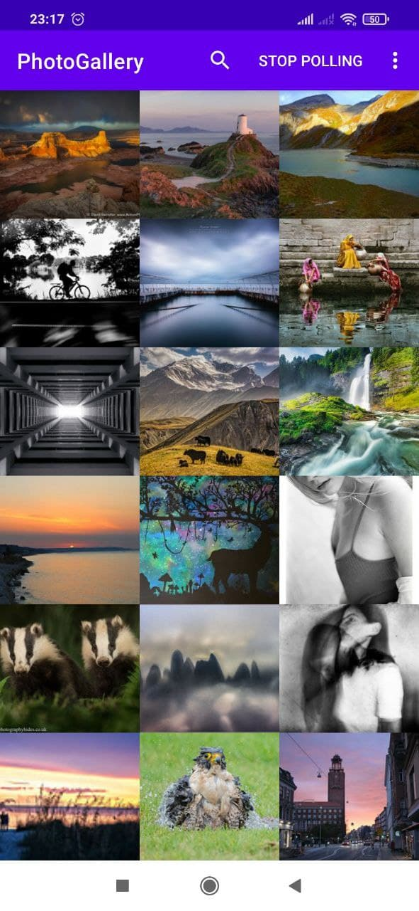

# PhotoGallery
Еще один тестовый учебный проект, в котором реализованы некоторые возможности операционной системы андроид.
Приложение написано в ходе чтения книги ["Android Programming: The Big Nerd Ranch Guide"](https://www.amazon.com/Android-Programming-Ranch-Guide-Guides/dp/0135245125/ref=dp_ob_title_bk).

Приложение запрашивает данные через REST API при помощи Retrofit. Преобразование полученных данных происходит при помощи Gson.
Фоновая загрузка полученных изображений организована через HandlerThread.
В приложении реализован поиск (SearchView) с сохранением последнего поискового запроса (SharedPreferences).
Приложение периодически запрашивает с ресурса новые фотографии в фоновом режиме при помощи WorkManager.
При наличии на сервисе новых фотографий приложение отправляет рассылку (Broadcast), а затем реагирует на нее и показывает уведомление.
Подробная информация о фотографиях показывается в WebView.

